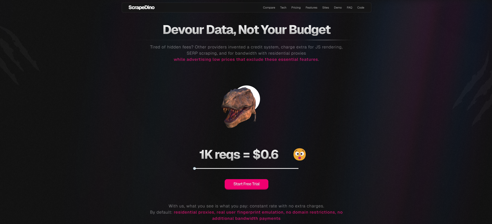

# scrapedino.com 🦖

<picture></picture>

<h4 align="center">
<a href="https://scrapedino.com/?utm_source=github&utm_medium=offpage">Website</a>
•
<a href="https://rapidapi.com/codeblessed-codeblessed/api/scrapedino/pricing">Pricing</a>
•
<a href="https://rapidapi.com/codeblessed-codeblessed/api/scrapedino/playground">Playground</a>
</h4>

<h3 align="center">We’re tired of hidden fees and limits, so we created the cheapest and most reliable JS Render Web Scraping API🔥</h3>

    
Other providers invented a credit system, charge extra for JS rendering, SERP scraping, and for bandwidth with residential proxies
    while advertising low prices that exclude these essential features. 
    With us, what you see is what you pay: constant rate with no extra charges. 
    <b>By default:</b> residential proxies, real user fingerprint emulation, no domain restrictions, no additional bandwidth payments

## 🤯 Every scrape request includes by default:
- ⚙️ **Fast JS Rendering:** Instantly render JavaScript for quick data access.
- 🌎 **Global Residential Proxies:** We use premium residential proxies in over 30+ countries by default.
- 🧑‍💻 **Real User Fingerprint:** We emulate a real user's headful browser, including cookies and a TLS fingerprint.
- 🔥 **Cloudflare & Anti-Bot Bypass:** Easily bypass bot protections and access data without restrictions.
- 💽 **Unlimited Bandwidth:** No limits on the number of gigabytes transferred.
- 🔁 **Auto IP Rotation:** Each of your API requests automatically uses a unique IP address.
- 📶 **High Call Limits:** Our uptime is 99.99%, supporting up to 50 requests per second.
- 💸 **Lowest Price:** Ready-made package includes 8,250 URL requests, each request costing just $0.0006 - the lowest price on the market.
- 🛒 **PAY-AS-YOU-GO:** After using the package, there’s no need to buy a new one—simply pay per request for any additional usage.

<h4>Start for FREE 💎 – Get 300-free scrapes! No credit card required! Just sign up and test it out.</h4>

 

## 📝 Comparison: ScrapeDino vs Others

| Feature | ScrapeDino 🦖 | Other Providers ❌ |
|---------|-------------|----------------|
| 🛠️ JS Rendering Included | ✅ | ❌ Extra charge |
| 🌏 Premium Residential Proxies | ✅ | ❌ Paid separately |
| 🛡️ Cloudflare & Anti-Bot Bypass | ✅ | ❌ Requires manual setup |
| 📀 Unlimited Bandwidth | ✅ | ❌ Extra fees per GB |
| 🏆 Best Price | ✅ $0.0006/req | ❌ More expensive |

 

## Join Us
- [Website](https://scrapedino.com/?utm_source=github&utm_medium=offpage)
- [RapidApi](https://rapidapi.com/codeblessed-codeblessed/api/scrapedino)
- [Twitter](https://x.com/ScrapeDino)
- [Crunchbase](https://www.crunchbase.com/organization/scrapedino)